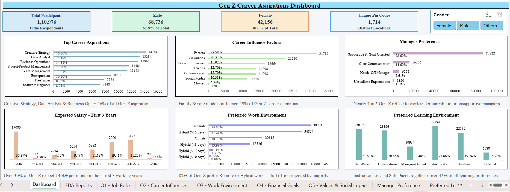
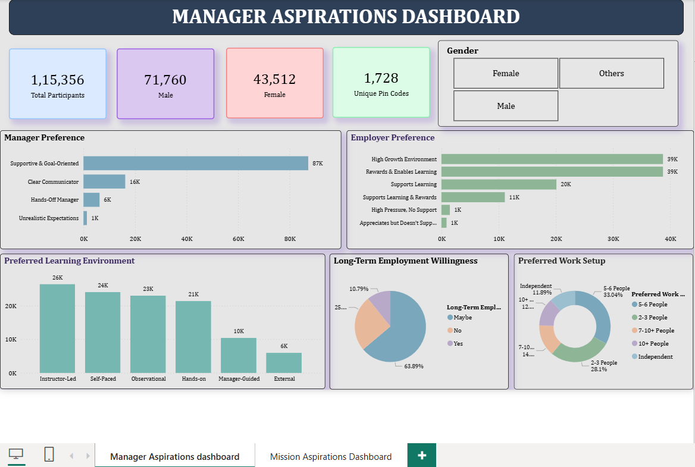
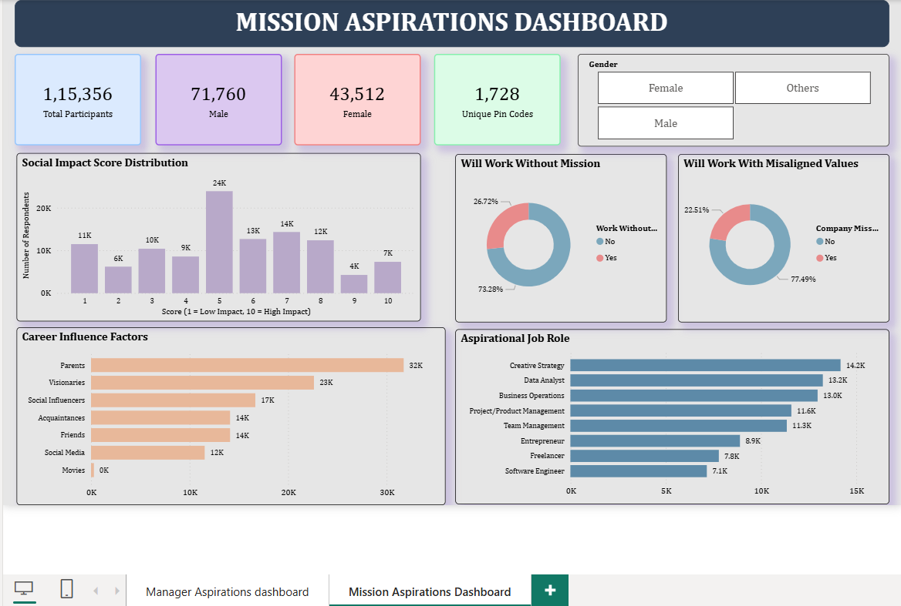

# Data Analytics Internship - KultureHire

## 📌 Project Overview
Analysed survey responses from **1,10,976 Gen-Z individuals** 
across India to uncover career aspirations, salary expectations, 
workplace preferences, and value-driven career choices.

Built for HR leaders, recruiters, and employers to make 
data-backed decisions when attracting and retaining Gen-Z talent.

---

## 🎯 Business Questions Answered
1. What industries are Gen-Z most interested in?
2. What are the top factors influencing career choices?
3. What is the desired work environment?
4. How do financial goals impact career aspirations?
5. What role do values and social impact play?

---

## 🔧 Tools Used
| Tool | Purpose |
|---|---|
| Microsoft Excel | Data cleaning, EDA, pivot tables, dashboard |
| MySQL | SQL queries for business insights |
| Power BI | Interactive functional dashboards |
| PowerPoint | Stakeholder presentation |

---

## 📊 Key Findings
- **Creative Strategy** is the #1 Gen-Z career aspiration (16.26%)
- **Parents** are the strongest career influence (28.58%)
- **34.43%** prefer full Remote work — 80%+ expect flexibility
- **30.87%** expect >₹50k/month in first 3 years
- **73.28%** refuse to work without a clear company mission
- **77.49%** reject employers with misaligned values

---

## 📁 Project Structure

├── data/             → Cleaned dataset (Excel)
├── sql/              → All 6 SQL queries with insights
├── excel-dashboard/  → Excel KPI dashboard
└── powerbi/          → Power BI dashboard (.pbix)

---

## 🗂️ Task Breakdown
| Task | Description | Tool |
|---|---|---|
| Task 1 | Problem Statement (5W1H Framework) | Document |
| Task 2 | Data Collection (18-question survey) | Google Forms |
| Task 3 | Data Cleaning & Standardisation | Excel |
| Task 4 | Exploratory Data Analysis (EDA) | Excel Pivot Tables |
| Task 5 | SQL Analysis | MySQL |
| Task 6 | Excel Dashboard | Excel |
| Task 7 | Power BI Dashboards | Power BI |
| Task 8 | Stakeholder Presentation | PowerPoint |

---

## 💡 Recommendations
1. **Define company mission** — 73% won't join without one
2. **Offer competitive pay** — 30.87% expect >₹50k from day one
3. **Embrace Remote/Hybrid** — 82% expect flexibility
4. **Train supportive managers** — 78.6% want goal-oriented leadership
5. **Invest in learning programs** — Instructor-led is top preference
6. **Engage families in hiring** — Parents are #1 influence at 28.58%

---

## 📸 Dashboard Previews
### Excel Dashboard

### Power BI Dashboard

